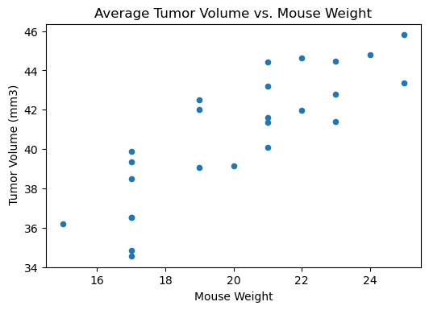
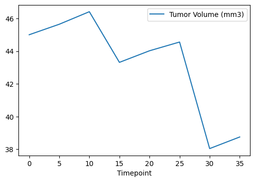
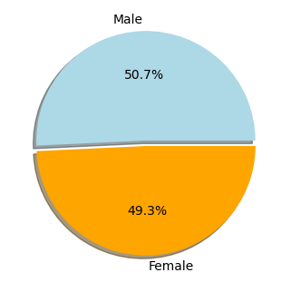
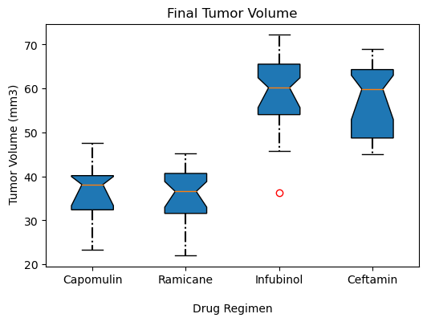
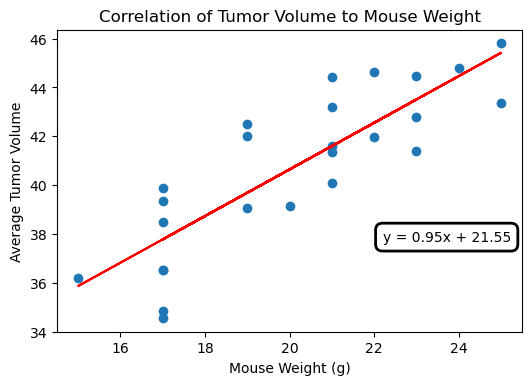

# Pymaceuticals Data Analysis

ᘛ⁐̤ᕐᐷ ◅&nbsp;&nbsp;&nbsp;&nbsp;<·^__)~~

 Tools, Languages, & Libraries Utilized

<li>Python</li>
<li>Pandas</li>
<li>Matplotlib</li>
<li>SciPy - Lingress</li>
<li>VS Code</li>
<li>Jupyter Notebook</li>

#### Use Python libraries Matplotlib and SciPy - Lingress to generate the charts needed for the technical report of the study.

### Contents:

		/data - csv files with data sets
                        /img - chart images
		

### Conclusions:

The scatter plot of Average Tumor Volume vs Mouse Weight (g) shows a clear correlation 
between tumor volume and mouse weight. The mice that were heavier, had a higher tumor 
volume on average.
 

 
Looking at our line plot of tumor volume vs, time point on the Capomulin drug regimen, 
it was an effective drug, decreasing the tumor volume in a majority of mice treated 
by this drug.
 

 
Pie chart shows that the sample distribution of genders is even. There were 50.7% (958) 
male mice and 49.3% (930) female mice.
 

 

### Additional Charts:

 

 
